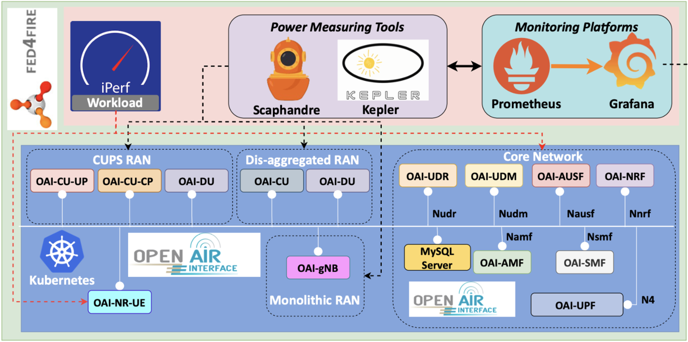

# 2024-ants-tutorial-epic-ran

<p align="center">
  
</p>
This is the official repository for ANTS 2024 "EPIC-RAN: Evaluating Power in Container Clouds for Open Radio Access Networks" tutorial.

## General Architecture

The general architecture of the OAI-5G deployment is as follows:


## Prerequisites

- A Kubernetes cluster
- Helm
- Kubectl
- Prometheus
- Grafana

## OAI-5G deployment using Helm Charts

OAI 5G deployments covers all the 3 scenarios of RAN, they are:

- Monolithic
- Disaggregated
- CUPS

## Running the demo

The first thing to do is to clone the repository and enter the directory:

```bash
git clone https://github.com/Mellgood/2024-ants-tutorial-epic-ran.git
cd 2024-ants-tutorial-epic-ran
```

All the following commands should be executed from the root directory of the repository.

### Installation - Monolithic

```bash
cd monolithic
./deploy_oai.sh mono
```

This will deploy the monolithic scenario, and it is successful if there is a ping from UE to CN, i.e, if this script executes successfully. The iperf3 test follows from the UE to the core automatically after a rest period.
All data will flow to prometheus and will be available in grafana.

### Installation - Disaggregated

```bash
cd disaggregated
./deploy_oai.sh dis
```

This will deploy the disaggregated scenario, and it is successful if there is a ping from UE to CN, i.e, if this script executes successfully. The iperf3 test follows from the UE to the core automatically after a rest period.
All data will flow to prometheus and will be available in grafana.

### Installation - CUPS

```bash
cd cups
./deploy_oai.sh cups
```

This will deploy the cups scenario, and it is successful if there is a ping from UE to CN, i.e, if this script executes successfully. The iperf3 test follows from the UE to the core automatically after a rest period.
All data will flow to prometheus and will be available in grafana.

## Related Publications

```bibtex
@article{centofanti2024impact,
  title={Impact of power consumption in containerized clouds: A comprehensive analysis of open-source power measurement tools},
  author={Centofanti, Carlo and Santos, Jos{\'e} and Gudepu, Venkateswarlu and Kondepu, Koteswararao},
  journal={Computer Networks},
  volume={245},
  pages={110371},
  year={2024},
  publisher={Elsevier}
}
@inproceedings{gudepu2024demonstrating,
  title={Demonstrating the Energy Consumption of Radio Access Networks in Container Clouds},
  author={Gudepu, Venkateswarlu and Tella, Rajashekhar Reddy and Centofanti, Carlo and Santos, Jos{\'e} and Marotta, Andrea and Kondepu, Koteswararao},
  booktitle={NOMS2024, the IEEE/IFIP Network Operations and Management Symposium},
  year={2024}
}
@inproceedings{gudepu2024earnest,
  title={EARNEST: Experimental Analysis of RAN Energy with Open-Source Software Tools},
  author={Gudepu, Venkateswarlu and Chirumamilla, Bhargav and Tella, Rajashekhar Reddy and Bhattacharyya, Abhishek and Agarwal, Shubh and Malakalapalli, Lavanya and Centofanti, Carlo and Santos, Jos{\'e} and Kondepu, Koteswararao},
  booktitle={2024 16th International Conference on COMmunication Systems \& NETworkS (COMSNETS)},
  pages={1148--1153},
  year={2024},
  organization={IEEE}
}
```

## Acknowledgements

Thanks to my colleagues for their support and contributions to this work.

- Jose Santos (Gent University)
- Rajashekhar Reddy Tella (IIT Dharwad)
- Venkateswarlu Gudepu (IIT Dharwad)
- Andrea Marotta (University of L'Aquila)

For questions or support, please use GitHub's issue system.
